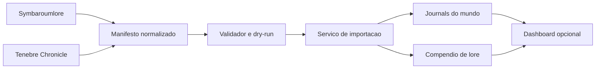

# Plano de Integracao de Lore e Cronica

## Resposta de viabilidade

Sim. Os dois projetos podem ser levados para dentro do Foundry sem depender dos sites externos durante a mesa.

A implementacao correta nao e incorporar as paginas React por iframe. Ela consiste em converter o conteudo para `JournalEntry`, `JournalEntryPage`, pastas, compendios, links UUID, ownership e, quando apropriado, Scenes, Actors e Items nativos.

## Escopo dos projetos

| Projeto | Natureza | Autoridade recomendada |
| --- | --- | --- |
| Symbaroumlore | Enciclopedia editorial/versionada | Compendio do modulo |
| Tenebre Chronicle | Cronica mutavel da mesa | Documents do mundo |

## Arquitetura alvo



Componentes futuros:

1. **Extratores fora do runtime:** convertem arrays React e snapshot da campanha em JSON normalizado.
2. **Validador:** verifica schema, IDs, links, ownership, midia e duplicatas.
3. **Importador de dominio:** cria ou atualiza Documents por API publica.
4. **Indice de origem:** resolve `sourceId` para UUID e impede duplicacao.
5. **Relatorio/dry-run:** informa alteracoes antes da escrita.
6. **Dashboard opcional:** ApplicationV2 para navegar e filtrar Documents ja existentes.

## O que nao deve ser feito

- iframe dos sites como implementacao principal;
- banco paralelo de diarios em settings ou flags;
- HTML React compilado dentro de Journal;
- edicao direta de bancos de compendio;
- duplicacao de Actor, Item, poder, ritual ou equipamento ja existente;
- sincronizacao bidirecional com Supabase na primeira versao;
- mistura de notas publicas e segredos no mesmo Document;
- importacao automatica no `ready` sem confirmacao.

## Modelo normalizado

```json
{
  "schema": 1,
  "generatedAt": "2026-07-21T00:00:00.000Z",
  "sources": [
    {
      "id": "symbaroumlore",
      "entries": []
    },
    {
      "id": "tenebre-chronicle",
      "entries": []
    }
  ]
}
```

Cada entrada deve conter ao menos:

- `sourceId` estavel;
- `kind`;
- `name`;
- `visibility`;
- `sort`;
- `pages`;
- `relationships`;
- `assets`;
- `sourceHash`.

## Fases de implementacao

### Fase 0 - Governanca e backup

- confirmar quais textos e imagens podem ser redistribuidos;
- classificar todas as notas da campanha;
- exportar snapshot do Tenebre Chronicle;
- criar backup do mundo e dos projetos;
- registrar contagens por colecao.

Saida: inventario aprovado e nenhum dado escrito no Foundry.

### Fase 1 - Schema e extratores

- definir schema JSON versionado;
- extrair Symbaroumlore sem raspar HTML;
- exportar Tenebre Chronicle do Supabase ou fallback;
- normalizar rich text, datas, slugs e assets;
- produzir relatorio de erros.

Saida: manifestos reproduziveis e testaveis fora do Foundry.

### Fase 2 - Dry-run e validador

- validar unicidade de `sourceId`;
- validar caminhos e tipos de assets;
- localizar links quebrados;
- conferir classificacao de visibilidade;
- comparar contagens com a origem;
- gerar plano de criacao/atualizacao sem persistir.

Saida: relatorio aprovado pelo GM.

### Fase 3 - Compendio Symbaroumlore

- criar pack de `JournalEntry` declarado no manifesto;
- importar lore autorizado;
- resolver links UUID em duas passagens;
- configurar ownership do pack e pastas;
- permitir importacao de copia editavel para o mundo.

Saida: enciclopedia nativa, pesquisavel e sem dependencia do site.

### Fase 4 - Migracao Tenebre Chronicle

- criar hierarquia de pastas no mundo;
- importar sessoes, personagens, NPCs, arquivo e notas;
- separar paginas publicas de preparacao secreta;
- ligar dossies a Actors existentes;
- aplicar ownership por registro;
- importar imagens para armazenamento estavel.

Saida: campanha utilizavel pelo GM e jogadores no Foundry.

### Fase 5 - CRUD e experiencia de uso

- validar criacao, edicao e exclusao pelas sheets nativas;
- adicionar apenas atalhos realmente necessarios;
- permitir notas pessoais e compartilhadas com ownership correto;
- manter links UUID e indices atualizados;
- nao duplicar funcionalidades nativas do diretorio de Journals.

Saida: fluxo completo sem site externo.

### Fase 6 - Dashboard opcional

- ApplicationV2 para indice, filtros e navegacao;
- secoes Lore, Sessoes, Personagens, NPCs, Arquivo e Notas;
- botoes abrem Documents nativos;
- visibilidade calculada por permission, nao por filtros cosmeticos;
- nenhuma persistencia propria no dashboard.

Saida: interface integrada sem comprometer os Documents.

### Fase 7 - Atualizacao e exportacao opcionais

- verificar novas versoes do lore por hash;
- mostrar diff antes de atualizar copias locais;
- exportar Journals da campanha para formato portavel;
- considerar sincronizacao externa somente com estrategia formal de conflitos e autenticacao.

Esta fase nao e necessaria para o primeiro objetivo.

## Permissoes e privacidade

Toda entrada deve ser classificada antes da criacao:

```text
public          -> OBSERVER para jogadores
shared-edit     -> OWNER para jogadores selecionados
player-private  -> OWNER para o jogador e GM
gm-secret       -> NONE para todos os jogadores
```

As operacoes de importacao devem verificar permissao de GM. Sockets, se necessarios, devem validar operacao, IDs, ownership e executor; nunca confiar em `userId` enviado pelo cliente.

## Atualizacao em tempo real

A edicao cotidiana usa o comportamento nativo dos Journals. O modulo nao precisa criar um protocolo proprio de sincronizacao entre clientes.

O dashboard opcional deve reagir a hooks publicos de criacao, atualizacao e exclusao de Journal e reconsultar os Documents. Os hooks devem ser registrados uma unica vez e removidos no teardown correspondente da Application.

## Migracao e rollback

Antes da escrita:

1. exportar o mundo ou criar backup;
2. salvar manifesto normalizado;
3. executar dry-run;
4. registrar UUIDs criados em um relatorio de migracao.

Rollback deve excluir apenas Documents criados pela execucao identificada, usando flags e IDs registrados. Documents preexistentes ou editados depois da migracao nao podem ser apagados automaticamente.

## Matriz de validacao

### Versoes

- Foundry v13 no build suportado;
- Foundry v14 no build alvo antes de declarar compatibilidade.

### Papeis

- GM;
- jogador;
- jogador confiavel;
- usuario sem Actor atribuido.

### Fluxos

- abrir e pesquisar lore;
- criar e editar nota autorizada;
- impedir edicao sem ownership;
- ocultar segredos do GM;
- abrir links UUID;
- mostrar Journal aos jogadores;
- pins de Scene;
- reload e reconexao;
- dependencia Symbaroum ativa;
- assets ausentes;
- segunda importacao sem duplicacao;
- rollback.

## Riscos prioritarios

| Risco | Mitigacao |
| --- | --- |
| Vazamento de notas | Documents separados e testes como jogador |
| Redistribuicao indevida | Gate juridico antes do pack publico |
| Duplicacao mecanica | Links para Actor/Item oficiais |
| Perda de edicoes | Foundry como autoridade e diff antes de atualizar |
| Slugs duplicados | Validacao e `sourceId` namespaced |
| Imagens quebradas | Copia para armazenamento estavel e relatorio |
| Conflito v13/v14 | Documents comuns e adapter pequeno para UI |
| Importacao parcial | Execucao idempotente, relatorio e rollback |

## Decisoes que precisam ser tomadas antes do codigo

1. Quais secoes do Symbaroumlore podem entrar no release publico?
2. O lore sera somente leitura ou o modulo oferecera importacao de copias editaveis?
3. Quais `masterNotes` sao avisos publicos e quais sao segredos?
4. Quais personagens/NPCs correspondem a Actors existentes?
5. Onde os assets da campanha serao armazenados?
6. Jogadores poderao criar Journals livremente ou apenas dentro de pastas preparadas?
7. O site externo sera arquivado ou continuara como exportacao secundaria?

## Recomendacao de primeira entrega

A primeira entrega deve ser pequena e reversivel:

1. importar uma secao de lore autorizada em pack de teste;
2. importar uma sessao publica e uma nota secreta em mundo de teste;
3. validar links, ownership e edicao como GM/jogador em v13 e v14;
4. somente depois ampliar para o conjunto completo.

Esse piloto valida a arquitetura sem colocar todo o acervo ou o mundo em risco.

